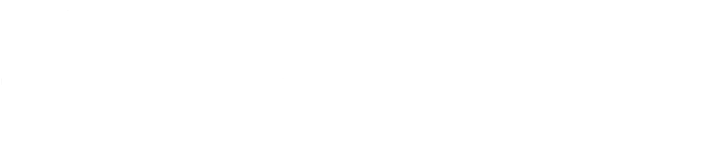

<div align="center">

<!-- Replace with your actual logo -->


# Codetopia Community Website

> *A utopia for tech enthusiasts*

[](https://github.com/codetopiacommunity/community-website/actions/workflows/ci.yml)

[🌐 Live Site](https://codetopia.org) · [🚧 Staging](https://staging.codetopia.org) · [💬 Discord](https://discord.gg/nPmRWdTQAK) · [🐛 Report Bug](https://github.com/codetopiacommunity/community-website/issues) · [✨ Request Feature](https://github.com/codetopiacommunity/community-website/issues)

</div>

---

## About

The Codetopia Community Website is the digital hub for the community initiative of **[Codetopia](https://codetopia.org)**. As a specialized branch of its parent organization, the community exists as an inclusive, collaborative sanctuary designed to empower aspiring and practicing technologists through peer-to-peer growth and collective innovation.

---

## Built With

| Technology | Purpose |
|------------|---------|
| [Next.js](https://nextjs.org) | Framework (App Router) |
| [shadcn/ui](https://ui.shadcn.com) | UI Components |
| [Tailwind CSS](https://tailwindcss.com) | Styling |
| [Biome](https://biomejs.dev) | Linting & Formatting |
| [pnpm](https://pnpm.io) | Package Manager |
| [Vercel](https://vercel.com) | Deployment |

---

## Getting Started

### Prerequisites

- Node.js 20+
- pnpm

```bash
npm install -g pnpm
```

### Installation

1. Fork the repository
2. Clone your fork

```bash
git clone https://github.com/YOUR_USERNAME/community-website.git
cd community-website
```

3. Install dependencies

```bash
pnpm install
```

4. Start the development server

```bash
pnpm dev
```

Open [http://localhost:3000](http://localhost:3000) to view it in your browser.

---

## Contributing

We welcome contributions from everyone! Please read our [Contributing Guide](CONTRIBUTING.md) to get started and our [Code of Conduct](CODE_OF_CONDUCT.md) before participating.

> ⚠️ All pull requests should target the `dev` branch, never `main` directly.

---

## Branch Structure

| Branch | Purpose |
|--------|---------|
| `main` | Production — live at codetopia.org |
| `dev` | Staging — preview at staging.codetopia.org |
| `feat/*` | Feature branches |
| `fix/*` | Bug fix branches |
| `docs/*` | Documentation branches |

---

## Core Maintainers

- [@cerebrocerberus](https://github.com/iamcerebrocerberus) 
- [@papayankey](https://github.com/papayankey)
- [@ichigo-k](https://github.com/ichigo-k) 
- [@larryQuao](https://github.com/larryQuao) 
- [@kali-physi-hacker](https://github.com/kali-physi-hacker) 

---

## Connect With Us

| Platform | Link |
|----------|------|
| 🌍 **Website** | [community.codetopia.org](https://community.codetopia.org) |
| 💬 **Discord** | [Join our Discord](https://discord.gg/nPmRWdTQAK) |
| 📺 **YouTube** | [@codetopiacommunity](https://www.youtube.com/@codetopiacommunity) |
| 💼 **LinkedIn** | [Codetopia Community](https://www.linkedin.com/company/codetopiacommunity) |
| 🐦 **Twitter/X** | [@codetopiacom](https://x.com/codetopiacom) |
| 📸 **Instagram** | [@codetopiacom](https://www.instagram.com/codetopiacom/) |
| 🧵 **Threads** | [@codetopiacom](http://www.threads.com/codetopiacom/) |
| 🎵 **TikTok** | [@codetopiacommunity](https://www.tiktok.com/@codetopiacom) |
| 🦋 **Bluesky** | [@codetopiacommunity](https://bsky.app/profile/codetopiacommunity.bsky.social) |
| 🐘 **Mastodon** | [@codetopiacommunity](https://mastodon.social/@codetopiacommunity) |
| 🟢 **WhatsApp** | [Join our Community](https://whatsapp.com/channel/0029VaFHtkR8KMqpEVu24v2o) |
| 🐙 **GitHub** | [codetopiacommunity](https://github.com/codetopiacommunity) |

---


<div align="center">

<a href="https://codetopia.org">Codetopia</a> — Engineering the future. 

</div>
